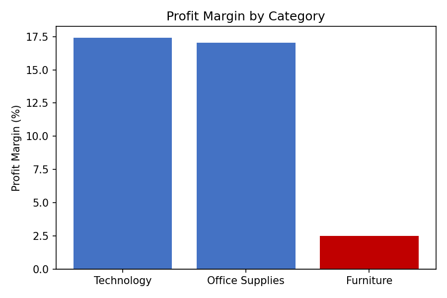
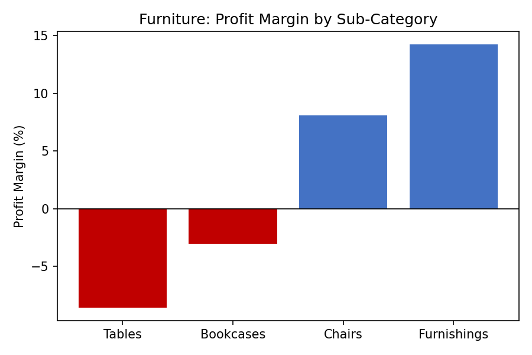

# retail-sales-profitability-analysis
Analyzing product, region, and segment profitability rather than just revenue. Built with SQL and Python.

## Business Problem
Leadership needs to know which products, regions, and customer segments are actually profitable — not just high in revenue — before finalizing next year's budget. This matters because revenue alone can hide the real picture: heavy discounting can make sales numbers look strong while quietly turning profit negative.

## Dataset

- **Source:** [Superstore Sales Dataset (Kaggle)](https://www.kaggle.com/datasets/vivek468/superstore-dataset-final)
- **Size:** 9,994 rows × 21 columns
- **Contents:** Order-level retail transactions including product, customer, region, date, quantity, sales, discount, and profit fields

## Tools Used

- **Python (Pandas)** — data loading, profiling, and cleaning
- **SQLite + SQL** — business-question analysis via aggregation queries
- **Jupyter Notebook** — development environment

## Data Cleaning

**Profiling results:**
- No missing values in any column
- No duplicate rows
- `Order Date` and `Ship Date` were stored as text (`object`) instead of proper dates — converted using `pd.to_datetime()`
- Category, Sub-Category, Region, and Segment values checked via `.unique()` — all confirmed consistently formatted, no fix needed
- Outlier check on Sales/Discount/Profit via `.describe()`: Discount max was 0.8 (80%) — valid, no data error. Profit had a minimum of −6599.98

**Decision:** Extreme negative-profit values were retained rather than removed, since they represent genuine loss-making transactions — likely driven by heavy discounting — that are directly relevant to the profitability question this analysis investigates. Removing them would hide the exact pattern being studied.

## Analysis & Key Findings

**1. Category Profitability** — Furniture generates comparable sales to Technology and Office Supplies, but converts almost none of it to profit (2.49% margin vs. ~17% for the other two), and carries the highest average discount.

**2. Furniture Sub-Category Breakdown** — The category-level number hides a split: **Tables (−8.56% margin) and Bookcases (−3.02% margin) are sold at a loss**, while Chairs (8.10%) and Furnishings (14.24%) are healthy. Discount level tracks closely with margin across all four sub-categories.

**3. Regional Profitability** — The same discount–margin pattern repeats independently at the regional level: Central has the highest discount (24.04%) and worst margin (7.92%); West has the lowest discount (10.93%) and best margin (14.94%).

**4. Customer Segment Profitability** — Consumer has the worst margin (11.55%) despite a discount level nearly identical to Corporate's (~15.8%) — the discount-margin pattern doesn't fully hold here.

**5. Segment × Category Cross-Check** — Tested whether Consumer simply buys more Furniture: it doesn't (Furniture is ~28–34% of sales across all segments, no meaningful difference). Consumer's Furniture-specific discount (17.67%) is only marginally higher than Corporate's (17.41%) or Home Office's (16.50%), yet its Furniture margin (1.79%) is notably worse — discount is directionally consistent but not a complete explanation.

## Business Recommendations

1. **Cap discounting on Tables and Bookcases specifically** — not Furniture as a whole, since Chairs and Furnishings remain profitable.
2. **Review Central region's discounting practices** before its sales volume grows, since the inefficiency is currently small in dollar terms only because Central has the lowest sales volume of the four regions.
3. **Investigate Consumer segment's Furniture purchases further** (order size, specific products, shipping cost) — discount alone doesn't fully explain the margin gap.
4. **Use discount % as an early-warning metric** — every weak-margin group identified in this analysis also carried the highest discount in its comparison.

## Limitations

- Discount correlates with lower margin throughout, but correlation isn't proven causation — cost structure or pricing differences weren't directly tested.
- The Segment-level finding shows discount only partially explains the margin gap — a fuller explanation would need order-size or shipping-cost data not explored here.
- Extreme negative-profit rows were kept based on reasoning, not confirmed with a real business source.
- This analysis is historical/descriptive, not a forecast.

## What I Learned

- How to separate "is this product selling well" (revenue) from "is this product actually making money" (profit/margin) and why relying on revenue alone can hide a real problem.
- How to test a hypothesis with data rather than assume it: my first guess (Consumer buys more Furniture) turned out to be wrong, and the data pointed me toward a more precise explanation instead.
- The importance of flagging when a pattern only partially holds, rather than overclaiming a clean explanation.

**1. Category Profitability** — Furniture generates comparable sales to Technology and Office Supplies, but converts almost none of it to profit (2.49% margin vs. ~17% for the other two), and carries the highest average discount.

**2. Furniture Sub-Category Breakdown** — The category-level number hides a split: **Tables (−8.56% margin) and Bookcases (−3.02% margin) are sold at a loss**, while Chairs (8.10%) and Furnishings (14.24%) are healthy. Discount level tracks closely with margin across all four sub-categories.

